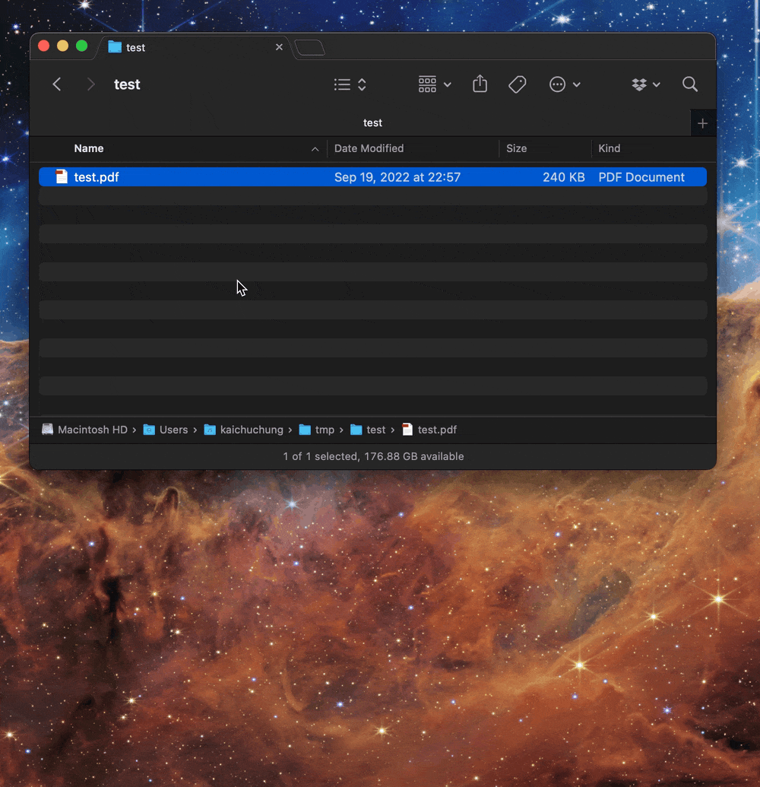
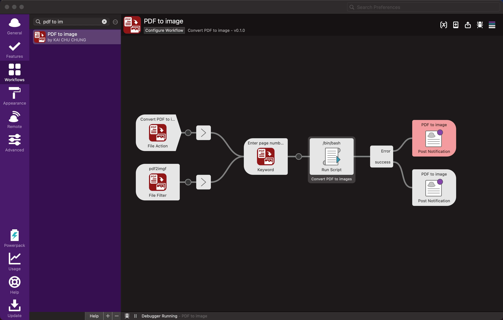

# alfred PDF to image

Convert PDF to image with Alfred.

## Features

- Convert PDF to image by page range

## Download
Make sure to download the latest released directly from the releases page. [Download here](https://github.com/cage1016/alfred-pdf2image/releases).

## Requires
- Preferably Alfred 5

## Usage

- File Filter keyword: `pdf2img` or File action to pick up PDF file
- Enter page numbers and/or page ranges.
  - `2` means page 2
  - `5-8` means page 5 to 8
  - `-20` means page 1 to 20
  - `20-` means page 20 to last page
  - `-` means all pages

## Third Party Library

- [gen2brain/go-fitz: Golang wrapper for the MuPDF Fitz library](https://github.com/gen2brain/go-fitz)

## Change Log

### 0.1.0
- Initial release

## License
This project is licensed under the MIT License. See [LICENSE](LICENSE) for details.